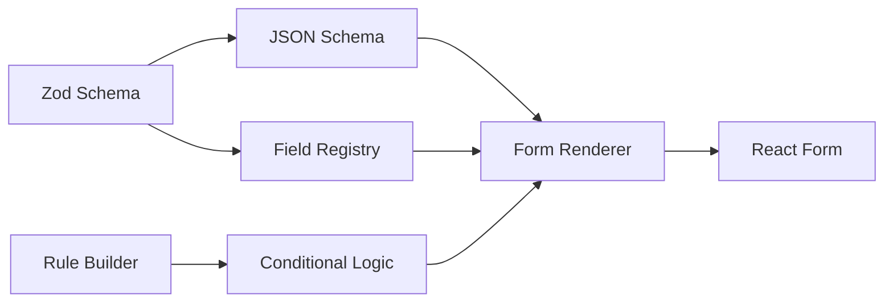

# Conform

Dynamic schema-driven forms for React with visual rule building.

[](https://www.npmjs.com/package/conform)
[](http://www.typescriptlang.org/)

## Features

- **Schema-driven**: Generate forms from Zod schemas
- **Visual rule builder**: Create conditional logic without code
- **Type-safe**: Full TypeScript support with validation
- **Rich field types**: 20+ built-in field components
- **CLI tools**: Project scaffolding and code generation

## Quick Start

```bash
npm install conform
```

### Simple Form

```tsx
import { conform, field } from "conform";

const userForm = conform.form({
  name: field.text({ placeholder: "Full name" }),
  email: field.email(),
  age: field.slider({ min: 18, max: 100 }),
  category: field.select(["personal", "business"]),
});

function App() {
  return userForm.render({
    onSubmit: (data) => console.log(data),
    columns: 2,
  });
}
```

### With Zod Schema

```tsx
import { z } from "zod";
import { SchemaForm } from "conform";

const schema = z.object({
  name: z.string().min(1),
  email: z.string().email(),
  age: z.number().min(18),
});

function App() {
  return <SchemaForm schema={schema} onSubmit={(data) => console.log(data)} />;
}
```

## Architecture



Conform uses Zod v4's JSON Schema conversion and registry system to separate form structure from UI metadata, enabling clean schemas with rich form capabilities.

## Field Types

```tsx
const form = conform.form({
  // Text inputs
  email: field.email(),
  password: field.password(),
  url: field.url(),
  phone: field.phone(),

  // Numbers
  rating: field.rating(5),
  price: field.slider({ min: 0, max: 1000 }),
  quantity: field.number({ min: 1, max: 100 }),

  // Rich content
  bio: field.textarea({ rows: 4 }),
  content: field.richText(),
  signature: field.signature(),

  // File uploads
  avatar: field.image(),
  documents: field.file({ multiple: true }),

  // Complex fields
  address: field.address(),
  dateRange: field.dateRange(),
  tags: field.array(field.text()),
});
```

## Conditional Logic

### Visual Rule Builder

```tsx
import { RuleBuilder } from "conform";

const fields = {
  accountType: { type: "string", options: ["personal", "business"] },
  companyName: { type: "string" },
};

<RuleBuilder fields={fields} onRulesChange={setRules} />;
```

### Programmatic Rules

```tsx
const rules = [
  {
    condition: { field: "accountType", operator: "equals", value: "business" },
    action: { type: "field-visibility", field: "companyName", visible: true },
  },
];

<RuleBasedSchemaForm schema={schema} rules={rules} />;
```

## CLI Tools

```bash
# Install CLI
npm install -g conform

# Create new project
conform init my-app --template nextjs

# Generate components
conform generate contact-form

# Generate documentation
conform docs --watch --open

# Validate schemas
conform validate src/
```

## API Reference

### conform.form(fields)

Creates a form with the streamlined API.

```tsx
const form = conform.form({
  name: field.text(),
  email: field.email(),
});
```

### SchemaForm

Renders forms from Zod schemas.

| Prop       | Type                           | Description             |
| ---------- | ------------------------------ | ----------------------- |
| `schema`   | `ZodObject`                    | Zod schema definition   |
| `onSubmit` | `function`                     | Form submission handler |
| `columns`  | `1 \| 2 \| 3`                  | Layout columns          |
| `spacing`  | `compact \| normal \| relaxed` | Field spacing           |

### RuleBuilder

Visual interface for creating conditional logic.

| Prop            | Type           | Description         |
| --------------- | -------------- | ------------------- |
| `fields`        | `FieldSchemas` | Available fields    |
| `onRulesChange` | `function`     | Rule change handler |
| `initialRules`  | `Rule[]`       | Starting rules      |

## Examples

- [Basic Form](./examples/basic-form)
- [Conditional Logic](./examples/conditional-logic)
- [File Uploads](./examples/file-uploads)
- [Multi-step Forms](./examples/multi-step)

## Contributing

See [CONTRIBUTING.md](./CONTRIBUTING.md) for development setup and guidelines.

## License

MIT
